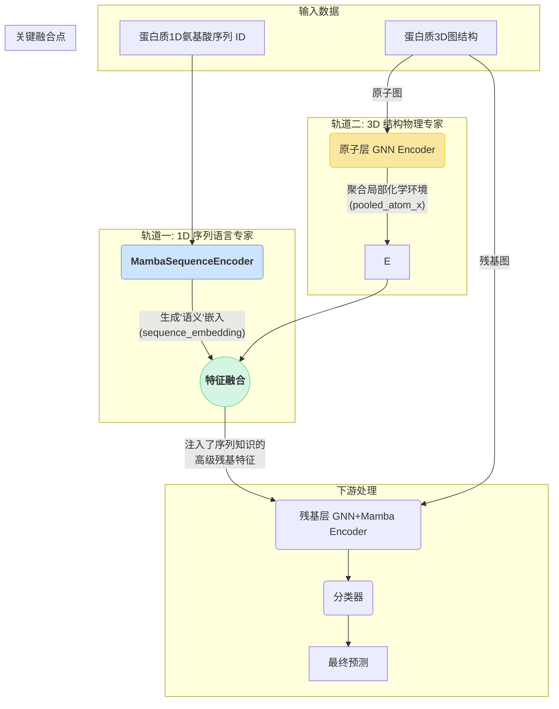

# 项目进展报告：模型架构重大升级

**版本**: 2.0
**日期**: 2024-08-16
**核心变更**: 模型架构从“残基层级双流”演进为“**1D序列-3D结构双轨协同机制**”，实现了更高层次的专业化分工与信息融合。

---

## 1. 架构演进背景

在上一版本中，我们成功实现了残基层级的双流架构，将**生化特征**和**几何特征**分离处理，取得了良好的效果。然而，为了进一步挖掘Mamba模型的潜力，并与蛋白质深度学习的前沿范式（如AlphaFold2、ESMFold）对齐，我们进行了本次根本性的架构升级。

核心思想源于最新的研究洞见：**将从海量1D序列数据中学到的“语言”知识，与从3D结构数据中学到的“物理”知识进行深度融合，可以取得1+1>2的效果**。为此，我们将模型重构为一个并行的双轨（Dual-Track）系统。

## 2. 核心技术架构：1D序列-3D结构双轨协同

新架构的核心是两个并行的、目标明确的“专家”信息流：

### 2.1. 轨道一：1D序列语言专家 (`MambaSequenceEncoder`)

- **角色**: 蛋白质语言模型 (Protein Language Model)。
- **任务**: 专门负责“阅读”并理解蛋白质的一级氨基酸序列。
- **实现**:
    - **输入**: 原始的氨基酸序列ID (`residue_seq_ids`)。
    - **核心**: 一个由纯Mamba模块（`InteractionBlock`配置为`use_gnn=False`）构成的深度编码器。
    - **优势**: 在不受3D结构干扰的情况下，Mamba可以最大限度地发挥其捕捉序列长程依赖的能力，学习氨基酸之间的共进化关系、功能基序等深层“语言”规律。
- **输出**: 为每个残基生成一个包含丰富上下文信息的**语义嵌入 (Sequence Embedding)**。

### 2.2. 轨道二：3D结构物理专家 (GNN Pipeline)

- **角色**: 几何与物理分析师。
- **任务**: 专门负责理解蛋白质的三维空间结构。
- **实现**:
    - **输入**: 原子和残基的图结构（节点、边、邻接关系）。
    - **核心**: 纯粹的图神经网络（GNN）模块。在原子层，我们现在配置`InteractionBlock`的`use_mamba=False`，使其成为一个专职的GNN。
    - **优势**: GNN专注于学习原子间的化学键、残基间的空间邻近性等局部和非局部的几何与物理规律。
- **输出**: 聚合了每个残基局部化学微环境的特征向量 (`pooled_atom_x`)。

### 2.3. 关键融合点：知识注入

这是新架构的“画龙点睛”之笔。我们不再使用预计算的、相对静态的残基生化特征，而是**将1D序列专家的输出——充满动态上下文信息的`sequence_embedding`——作为3D残基分析的起点**。

具体而言，我们将`sequence_embedding`和`pooled_atom_x`进行拼接融合，生成一个全新的、信息密度极高的高级残基特征。这个特征同时蕴含了：
- **“它应该是什么”**（来自1D序列的语义预测）。
- **“它周围有什么”**（来自3D结构的局部环境）。

这个融合后的特征，再被送入下游的残基层编码器（`feature_encoder`）进行最终的综合分析。

## 3. 新架构的优势

1.  **专业分工，各司其职**: Mamba和GNN不再是简单的“堆砌”，而是在各自最擅长的领域发挥到极致。
2.  **信息赋能 (Knowledge Injection)**: 3D结构分析不再是“从零开始”，而是站在了1D序列深度理解的“巨人肩膀上”，使得学习任务更简单、更高效。
3.  **巨大的潜力**: 该架构为未来的“预训练-微调”范式奠定了基础。我们可以先在海量的、无标签的蛋白质序列数据库（如UniProt）上预训练`MambaSequenceEncoder`，使其成为一个强大的通用蛋白质语言模型，然后在我们的下游任务上进行微调，有望取得更大的性能突破。 